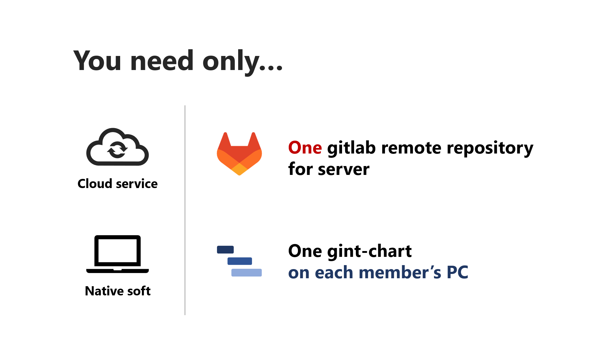
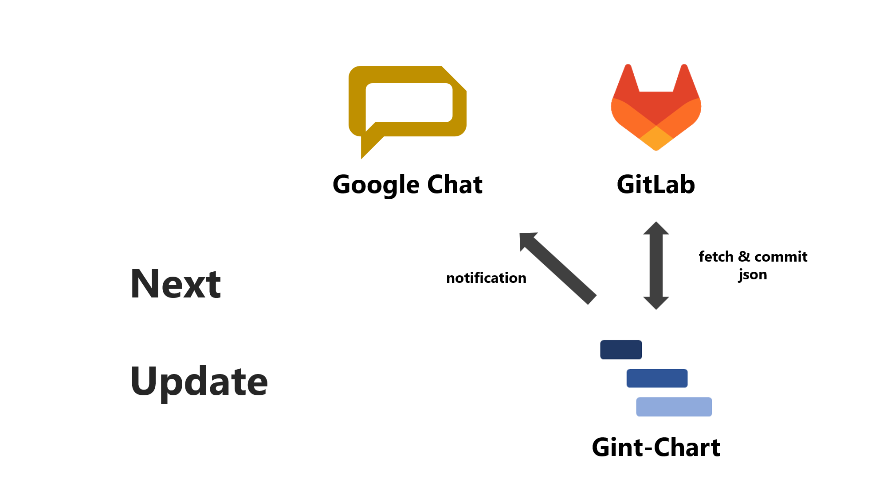

# なんだかんだ手軽に使えるタスク管理ツールがない

Redmineはなんだか使いにくいし、BackLogはお金かかる。

GitLabはPremiumにしないとガントチャートが使えない。

Githubのプロジェクトは便利だけど、会社から使っちゃダメって言われた。

# サーバーレスなタスク管理：Gint-Chart

特別なサーバーなし、GitLabに情報を集約してタスク管理する。

GitLabのリポジトリにチケットのデータをpushして、更新してcommitする。


GitLabのグループがあれば、メンバー間でタスク管理できる。


必要なのは、GitLabのリポジトリ1つと各メンバーのPCにgint-chartのネイティブアプリ。



将来的には、Google Chatみたいなコミュニケーションツールに、チケットの更新を通知する。



## うみだしたい

- シンプル

- 指先の感覚になじむ

- アジャイル

- 特別なサーバーは不要

- 無料

## 技術要素

- TypeScript

- Angular

- Electron

## 個人的な野望

- 最速（MVP）

- 横着（AI駆動）

- UIにはこだわる

- CI/CD

## 開発立ち上げ

コンソールにて以下を実行する。

```
npm run electron-dev
```