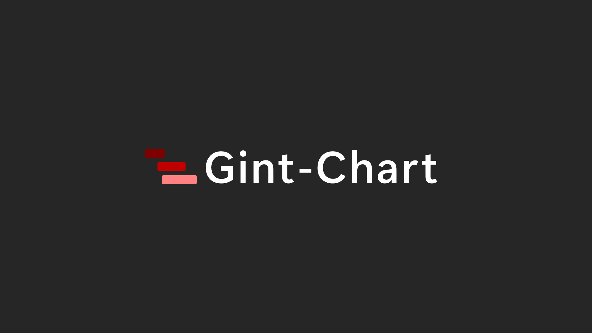
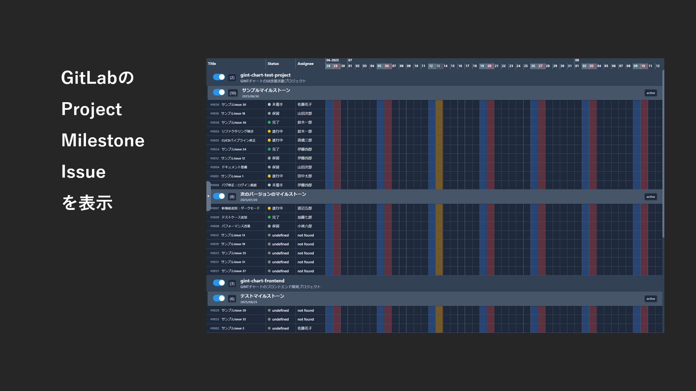
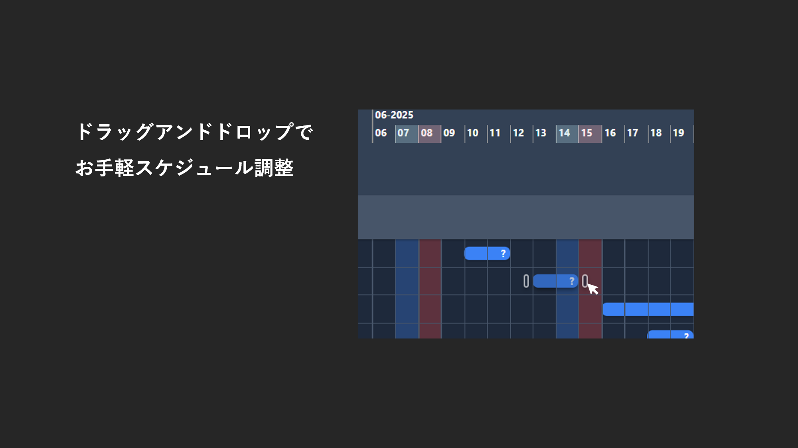
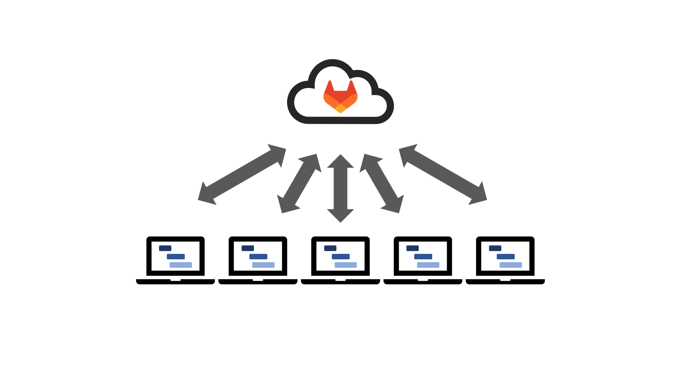
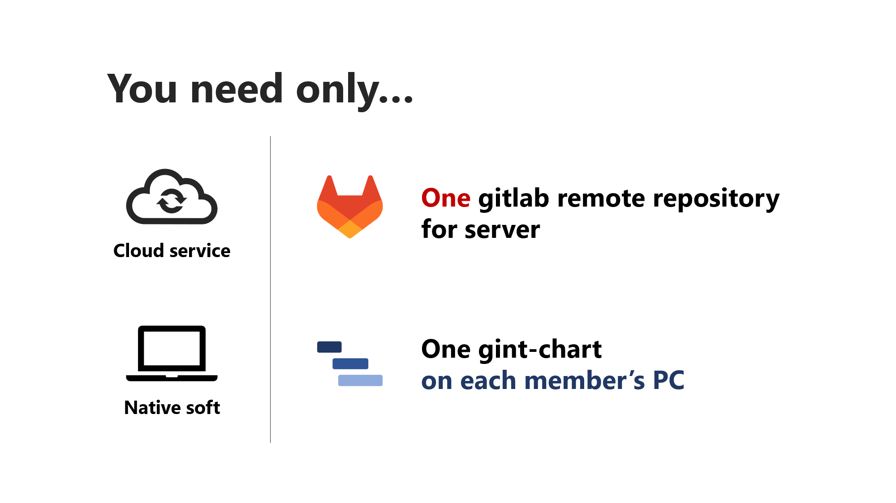

# GINT-CHART プロジェクト

> このプロジェクトは現在進行形です！
>
> 機能的に中途半端なところもありますので、ご容赦ください。
>
> 皆様からのフィードバックを受けてさらに進化します 🤗🤗

GitLab の Gantt チャート機能は Premium 版限定ですが、このアプリを使えば、GitLab で管理しているプロジェクト、マイルストーン、イシューをローカル PC にダウンロードし、Gantt チャートとして表示・編集できます。

これにより、GitLab の優れた UI と情報共有機能を活かしつつ、オフラインでの詳細なスケジュール調整が可能になり、業務の生産性向上を支援します。

### アプリ名

GitLab のサーバー機能を利用した、Gantt チャートなので・・・



### いいカンジな UI

GitLab の issue のリスト化、右側がチャート。



### 感覚的な操作

ドラッグアンドドロップで開始日と終了日を決定します。



### システム

GitLab と連携します。


GitLab はクラウドサーバーで、Gint-Chart はネイティブアプリです。



GitLab のサーバーと開発メンバーの PC に Gint-Chart をインストールすること。



## ダウンロード

mada

## GitLab 連携方法

アプリをダウンロードしたら、.exe ファイルと同じ階層に「gitlab.config.json」を作成してください。

json 中身の例

```
{
  "url": "https://gitlab.com",
  "projectId": [1, 2, 3],
  "accessToken": "****************",
  "groupId": 1
}
```

| No. | キー        | 値                    |
| --- | ----------- | --------------------- |
| 1.  | url         | GitLab サーバーの URL |
| 2.  | projectId   | プロジェクト ID (A)   |
| 3.  | accessToken | アクセストークン (B)  |
| 4.  | groupId     | グループ ID (C)       |

### A. プロジェクト ID の確かめ方

mada

### B. アクセストークンの確かめ方

mada

### C. グループ ID の確かめ方

mada

## ラベルの作成

mada

## 今後の展望

mada

---

## セキュリティについて

mada

## 開発技術要素

- TypeScript

- Angular

- Electron

- GitLab API
